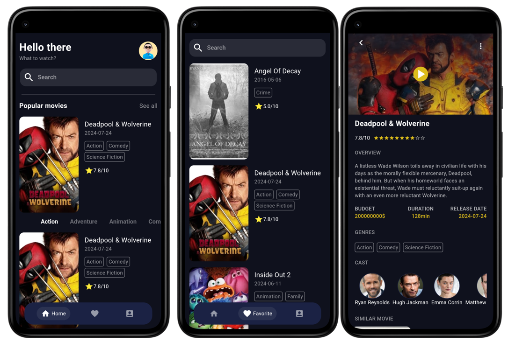
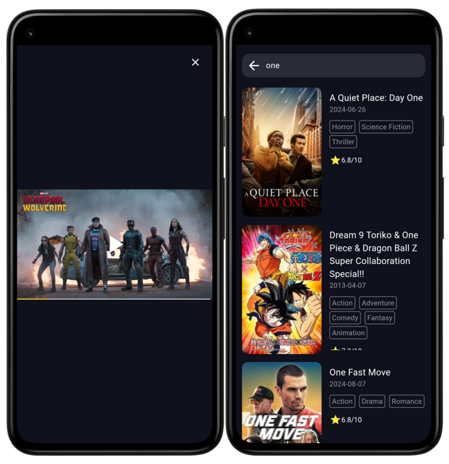

<h1> Movie App - Flutter </h1>
<h2> About this project</h2>
<h3> Project overview</h3>

This application is built on the [TheMovieDB](https://www.themoviedb.org/) platform, providing quick access to information on popular movies and those currently in theaters. It also allows users to save their favorite movies and watch trailers using the APIs provided by TheMovieDB

Android: You can try it at [here](movie_android.apk)

<h3> Features </h3>

- Support authentication based on API KEY
- Recommend popular movies
- Classify movies by genre such as Action, Adventure, Comedy, etc.
- Provide detailed information about movies such as rating, overview, duration, cast, similar movies, etc.
- Find movies by keyword
- Add/Delete movies to/from favorites
- Find movies in favorites

<h3> Used tech stack </h3>

- Clean architecture
- TheMovieDB API
- Sqlite cache data
- State Management: Bloc, StreamController, NotifierProvider

<h3> Some screenshots </h3>

